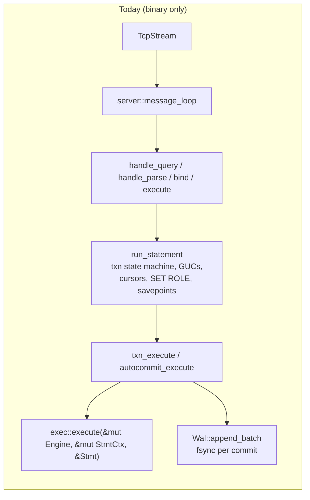
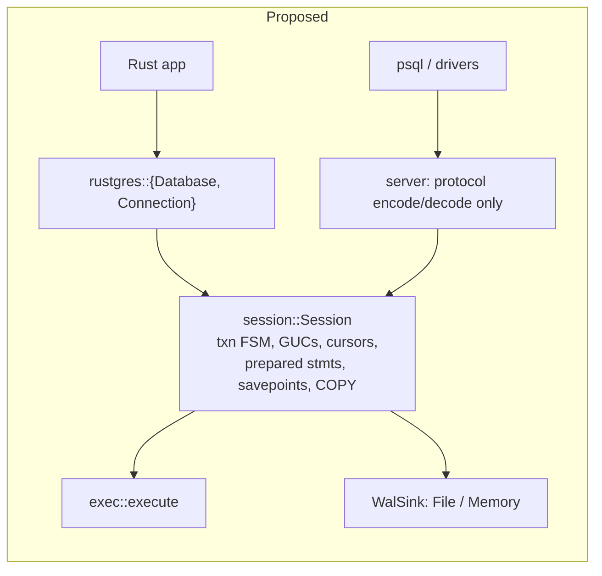
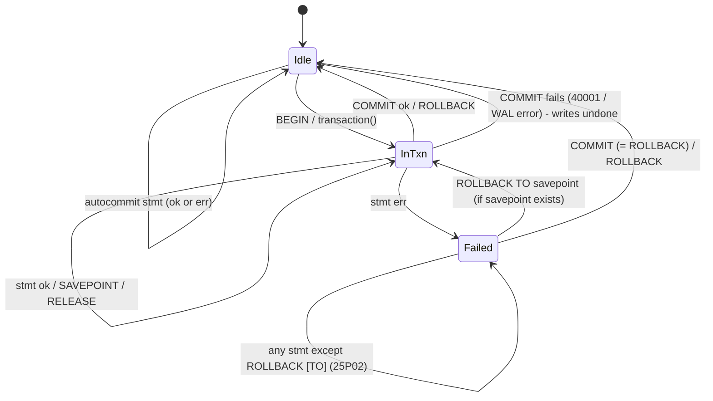

# ADR 0001 — Embedded Rust API

- **Status:** Proposed (design only — nothing in this ADR is implemented yet)
- **Date:** 2026-10-09
- **Deciders:** @madmax983

## Context

rustgres is only a server today. The crate has no library target
(`src/main.rs` declares every module `mod`/`pub(crate)`), so the only way
to use the engine is over the wire on port 5433. An embedded mode works
the way SQLite or DuckDB do: link the engine into the program and call it
in the same process. That lets you:

- use rustgres as an application database with no separate process, port,
  or auth setup;
- test Postgres-dialect SQL in plain `cargo test`, with no Docker or
  container;
- run an in-process server: one `Database` that the application calls
  directly *and* `psql` connects to.

### How the code is shaped today (the seams)



Facts that shape this design:

| Fact | Where | Consequence |
|---|---|---|
| `exec::execute(eng, ctx, stmt) -> Result<ExecResult, ExecError>` does no I/O | `src/exec/dispatch.rs:5` | The engine is already embeddable. The work is above it. |
| Transaction, GUC, cursor, prepared-statement and savepoint state live in `server::Session`, next to wire state (`portals`, `in_error`) | `src/server.rs:70` | This state machine has to come out of `server.rs` so both callers use the same code. |
| `run_statement(engine, wal, session, stmt)` does no I/O except COPY, which `handle_query` handles before it | `src/server.rs:3258` | This is the extraction seam. |
| One `Arc<Mutex<Engine>>` is held for each whole statement; lock order is engine → wal | `src/main.rs`, `txn_execute` | Statements already run one at a time. The embedded API inherits that and does not try to hide it. |
| Parameters are bound as `Value`s into the AST (`subst_params(&mut Stmt, &[Option<Value>])`) | `src/exec/params.rs:923` | Embedded callers can bind typed values directly, with no text round-trip. |
| Durability is WAL + checkpoint into an in-memory `Database`; `Wal::open(dir) -> (Engine, Wal)` | `src/wal/writer.rs:188` | `open(path)` already exists in practice. An in-memory mode needs a WAL sink that does nothing. |
| Nothing stops two processes opening the same data dir | (no lockfile) | Embedding makes this much easier to hit by accident, so it needs a guard. |
| Process-global state: `DATESTYLE_POSTGRES` (`datetime.rs:21`), `SESSION_COUNTS` (`server.rs:503`), `RANDOM_SEED` (`exec/arith.rs:160`) | — | Two `Database`s in one process (every test suite) would leak settings into each other. These must move to the session or the database. |
| Thread-locals (`NOTICE_SINK`, `LATERAL_NS`, format caches) are scoped to one statement or are pure caches | `exec/core.rs:118` | Moving a `Connection` to another thread *between* statements is safe. A statement never yields partway through, so a sync API is fine. |
| Zero external crates | `Cargo.toml` | No `thiserror` and no `tokio` in the core crate (see Decision 2). |

## Decision

### 1. One session engine, two front ends

Move the session state machine out of `server.rs` into `src/session.rs`.
Both the wire protocol and the embedded API then become thin layers on
top of it:



The conformance suite (4,753 PASS) then checks the code path that
embedded callers use as well. Without this, the embedded API would be a
second, untested copy of the transaction logic.

### 2. Sync core, zero dependencies; async lives in a separate crate

The engine runs each statement under one mutex and never yields partway
through. An `async fn query` in the core would only be `spawn_blocking`
in disguise, and would break the zero-crate rule. So:

- `rustgres` (core crate): a sync API, `Database: Send + Sync + Clone`,
  `Connection: Send` (not `Sync`).
- `rustgres-tokio` (a later workspace member, optional): `AsyncConnection`
  wraps `Connection` with `tokio::task::spawn_blocking`. This keeps the
  "Tokio for async" standard without making the core depend on it.

### 3. Proposed public surface

```rust
use rustgres::{Database, Config, params, Error, IsolationLevel};

// --- open -------------------------------------------------------------
let db = Database::open("./data")?;              // WAL + checkpoint recovery, data-dir lock
let db = Database::open_in_memory();             // no WAL; vanishes on drop
let db = Database::open_with(Config::new("./data")
    .synchronous_commit(true)                    // fsync per commit (today's behaviour)
    .datestyle(DateStyle::Iso))?;

// --- connect (a Session) ------------------------------------------------
let mut conn = db.connect();                     // superuser "postgres", like a trusted local socket
let mut conn = db.connect_as("alice")?;          // role must exist; privileges enforced

// --- execute ------------------------------------------------------------
conn.batch_execute("CREATE TABLE t (id int PRIMARY KEY, name text);
                    INSERT INTO t VALUES (1, 'a');")?;   // simple-protocol semantics (implicit txn block)
let n: u64 = conn.execute("UPDATE t SET name = $1 WHERE id = $2", params!["b", 1])?;

let rows = conn.query("SELECT id, name FROM t WHERE id > $1", params![0])?;
for row in &rows {
    let id: i32 = row.get("id")?;
    let name: Option<String> = row.get(1)?;
}
let count: i64 = conn.query_one("SELECT count(*) FROM t", params![])?.get(0)?;
let maybe = conn.query_opt("SELECT name FROM t WHERE id = $1", params![42])?;

// --- prepared statements -------------------------------------------------
let stmt = conn.prepare("SELECT name FROM t WHERE id = $1")?;   // parse once; param types inferred
stmt.param_types();                                              // &[Type]
let rows = conn.query_prepared(&stmt, params![1])?;

// --- transactions: RAII, rollback on drop -------------------------------
let mut tx = conn.transaction()?;                                // BEGIN
tx.execute("INSERT INTO t VALUES ($1, $2)", params![2, "c"])?;
{
    let mut sp = tx.savepoint("before_risky")?;                  // SAVEPOINT
    sp.execute("DELETE FROM t", params![])?;
    sp.rollback()?;                                              // ROLLBACK TO + RELEASE
}
tx.commit()?;                                                    // COMMIT (WAL fsync)

let tx = conn.build_transaction()
    .isolation(IsolationLevel::Serializable)
    .read_only(true)
    .start()?;

// --- errors ---------------------------------------------------------------
match conn.execute("INSERT INTO t VALUES (1, 'dup')", params![]) {
    Err(e) if e.sqlstate() == SqlState::UNIQUE_VIOLATION => { /* 23505 */ }
    Err(e) => return Err(e.into()),
    Ok(_) => {}
}

// --- notices (RAISE NOTICE, WARNINGs) --------------------------------------
conn.set_notice_handler(|n: &Notice| eprintln!("{}: {}", n.severity, n.message));

// --- COPY -------------------------------------------------------------------
conn.copy_in("COPY t FROM STDIN (FORMAT csv)", std::fs::File::open("t.csv")?)?;
conn.copy_out("COPY t TO STDOUT", &mut std::io::stdout())?;

// --- maintenance + embedded server ----------------------------------------
db.checkpoint()?;
let handle = db.serve("127.0.0.1:5433")?;   // same Database, also reachable from psql
handle.shutdown();
```

#### Types

- **`Value`** is a *public* enum, kept separate from the internal
  `storage::Value`. The internal enum has storage quirks callers should
  not depend on (`Int(i64)` holds INT4, `Text(Arc<str>)`, boxed arrays).
  Conversions are `pub(crate)`. The enum is `#[non_exhaustive]`. Its
  variants cover what the engine stores today: `Null`, `Bool`, `Int2`,
  `Int4`, `Int8`, `Float4`, `Float8`, `Numeric`, `Text`, `Char`, `Bytea`,
  `Date`, `Timestamp`, `Timestamptz`, `Uuid`, `Bit`, `Array`, `Record`.
  New variants (`Time`, `Interval`, `Json`, `Jsonb`) arrive when the engine
  gets those types. There is no `Value::Interval` or jsonb type today, and
  `json` exists only as a function result carried as text.
- **Date/time and numeric values use our own newtypes**
  (`rustgres::types::{Date, Timestamp, Timestamptz, Numeric}`).
  They wrap the internal representation and provide accessors
  (`Date::from_ymd`, `Timestamp::as_micros_since_epoch`,
  `Numeric::to_string` / `FromStr`). `chrono`/`time`/`rust_decimal` impls
  can come later in an optional adapter crate.
- **`ToSql` / `FromSql`** are implemented for `bool`, `i16`, `i32`, `i64`,
  `f32`, `f64`, `&str`, `String`, `&[u8]`, `Vec<u8>`, `[u8; 16]` (uuid),
  `Option<T>`, `Vec<T>` (arrays), and the newtypes above. `FromSql`
  rejects a lossy conversion (`int8` → `i32` overflow) with an error. It
  never truncates silently.
- **`Type`** is a public mirror of `ColType` with `oid()` and `name()`.
- **`Rows`** is materialized: the executor already produces `Vec<Row>`.
  Streaming (`query_iter`) comes later and is built on SQL cursors, which
  `session` already supports.
- **`Error`** is a hand-written `std::error::Error` with `sqlstate()`,
  `message()`, `detail()`, `hint()`, `position()`, and `kind()`
  (`Sql | Io | Conversion | Closed`). No `thiserror`, to keep the
  zero-crate rule.

### 4. Concurrency contract (documented, not hidden)

- `Database` is `Arc`-backed. Clone it freely across threads.
- Each `Connection` is one session. Many connections can exist at once,
  but statements across *all* connections run one at a time under the
  engine mutex, exactly as on the wire today. MVCC snapshots, row locks,
  `40001` serialization failures, and `SELECT ... FOR UPDATE` behave the
  same as over the wire, because it is the same code.
- Row-lock conflicts never wait. A `FOR UPDATE` or `UPDATE` that hits a
  row locked by another open transaction fails at once with `40001`
  (`exec/dml.rs` `check_row_lock`, which works like NOWAIT). Embedded
  callers must handle this with a retry loop. If real lock waiting is
  added later, it needs a wait queue *outside* the engine mutex and a
  deadlock detector, and that is engine work, not API work.
- `SERIALIZABLE` currently behaves like `REPEATABLE READ` (no SSI). The
  API docs must say so, so callers don't assume write-skew protection.
- Dropping a `Connection` with an open transaction rolls it back. Dropping
  the last `Database` handle does not checkpoint, because the WAL is
  already durable. `db.close()` checkpoints and releases the data-dir
  lock explicitly.

### 5. Transaction state machine (spec before code)

A `Connection` is in one of these states. The state machine in
`session.rs` gets this as its spec, and Verus later proves it:



Invariants (to be written as Verus specs over a ghost model of `Txn`):

1. **I1 Isolation of failure:** in `Failed`, no statement other than
   `ROLLBACK`, `ROLLBACK TO`, or `COMMIT` reaches `exec::execute`.
2. **I2 Savepoint stack:** `savepoints.len() == sub_xids.len()`, and every
   savepoint's recorded `writes.len()` is ≤ the current `writes.len()`
   and never decreases going down the stack.
3. **I3 Atomic commit:** after `COMMIT` returns `Ok`, every `WriteOp`
   in `writes` is in a WAL frame that was fsynced before the xid retired.
   After it returns `Err`, none of the writes are visible to any snapshot.
4. **I4 Drop = rollback:** dropping a `Transaction` guard without
   `commit()` leaves the database as if the guard had never existed.
5. **I5 One transaction per connection:** a `Transaction<'c>` mutably
   borrows its `Connection`. This is enforced by the borrow checker, so it
   needs no proof.

Verus is not installed in the cloud container. Writing the proofs for
I1–I3 is a local-machine task in Phase 1.

## Phased plan

| Phase | Deliverable | Exit criteria |
|---|---|---|
| **0. lib/bin split** | `src/lib.rs` owns the modules; `src/main.rs` becomes a ~30-line CLI calling `rustgres::server::run(Config)`. | Same conformance numbers; `cargo test` green. |
| **1. Extract `session`** | `src/session.rs` takes over `Session`'s transaction, GUC, cursor, prepared-statement, savepoint and COPY state; `server.rs` keeps only protocol encode/decode and calls `Session::{simple_query, parse, bind, execute}`. Process globals move into the `Session` or the database. | Conformance suite still at 4,753 PASS / 0 REAL-FAIL; wire `protocol_test*.py` green; Verus spec for the state machine in §5. |
| **2. Public API v0** | `Database`, `Connection`, `Transaction`, `Savepoint`, `Rows`, `Row`, `Value`, `Type`, `ToSql`/`FromSql`, `Error`, `params!`. `open_in_memory` via a do-nothing `WalSink`. Data-dir lockfile. | Rust integration tests in `tests/embedded_*.rs`: happy path, every `FromSql` boundary (overflow, NULL into a non-`Option`), drop-rollback, `25P02` after an error, savepoint rollback, crash-recovery round-trip (open → write → drop without close → reopen), two `Database`s in one process with different DateStyles. Doc comments on every public item. |
| **3. COPY + notices + prepared** | `copy_in`/`copy_out`, notice handler, `prepare` with param-type inference (reuses `resolve_param_types`). | Tests for each. |
| **4. `db.serve()`** | Embedded wire server sharing the `Database`. | A `psql`-equivalent Python client and an embedded `Connection` see each other's committed writes. |
| **5. `rustgres-tokio`** | Separate crate in the workspace; `spawn_blocking` adapter. | Its own tests; the core stays zero-dep. |

## Alternatives considered

- **Expose `Engine` + `exec::execute` directly.** Little work, but every
  caller would have to rebuild snapshots, xid allocation, undo-on-error,
  WAL commit, and savepoint bookkeeping, which is ~1,500 lines of subtle
  logic in `server.rs`. Rejected.
- **Embedded API that talks to an in-process server over a loopback
  socket.** No refactor needed, but it pays wire encode/decode and text
  conversion on every value, and loses typed binding. Rejected; `serve()`
  gives the "also reachable from psql" benefit without it.
- **An async-first core.** Rejected (Decision 2): the engine cannot yield
  partway through a statement, and it would break the zero-crate build.
- **Reuse `storage::Value` as the public value type.** Rejected: its
  representation is tuned for the executor (`Int(i64)` for INT4,
  `Arc<str>`), and freezing it would block storage refactors.

## Open questions

1. **Default role for `connect()`:** superuser (like a trusted local
   socket) or require `connect_as`? Proposed: superuser by default, since
   embedded callers own the process anyway.
2. **Crate name for the public API:** keep `rustgres` (lib + bin in one
   package) or split into a `rustgres` lib and a `rustgres-server` bin?
   Proposed: a single package for now; split if `rustgres-tokio` makes a
   workspace worthwhile.
3. **Synchronous commit default for embedded:** keep fsync-per-commit,
   which is safe and matches the server, or offer group commit? Proposed:
   keep it; expose `synchronous_commit(false)` as an opt-in later.
